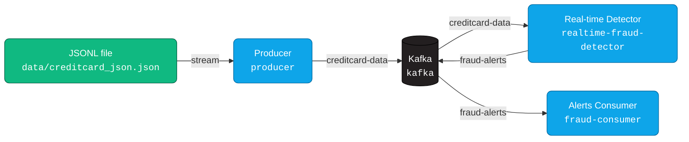

<!-- Badges -->
<p align="center">
  
  
  
  
  
</p>

<h1 align="center">🛡️ Real‑Time Fraud Detection (Kafka ➜ Spark ➜ Alerts)</h1>

---

## 📦 What you get 
> The compose file brings up everything you need. No extra config. No surprises.

- **Services**: `zookeeper`, `kafka`, `producer`, `realtime-fraud-detector`, `fraud-consumer`
- **Input topic**: <code>creditcard-data</code> (producer ⟶ Kafka)
- **Output topic**: <code>fraud-alerts</code> (detector ⟶ alerts)
- **Bootstrap**: <code>kafka:29092</code>

> 💡 Data source: the producer streams JSON lines from <code>data/creditcard_json.json</code> (one transaction per line).

---

## 🗺️ Big picture



---

## 🚀 Quickstart (one command)
<div style="border:1px solid #e2e8f0;border-left:6px solid #10b981;padding:12px;border-radius:8px;background:#f8fafc;">
<b>Run:</b>
<pre><code>docker compose up -d --build
</code></pre>
<b>Follow logs:</b>
<pre><code>docker compose logs -f producer realtime-fraud-detector fraud-consumer
</code></pre>
</div>

> The pipeline starts producing, scoring, and printing alert metrics automatically.

---

## 🧩 How each piece behaves (defaults)

<details><summary><b>📤 Producer (<code>producer</code>)</b></summary>

- Reads <code>data/creditcard_json.json</code> line‑by‑line
- Publishes to Kafka topic <code>creditcard-data</code>
- Waits for Kafka to be ready (via <code>wait-for-kafka-and-spark.sh</code>)
- Emits an <i>end‑of‑stream</i> marker so downstream can finish gracefully
- Logs every N records so you can see progress
</details>

<details><summary><b>⚡ Detector (<code>realtime-fraud-detector</code>)</b></summary>

- Subscribes to <code>creditcard-data</code>
- Applies the exact feature contract (Amount, Time, V1..V28 + time features) expected by the bundled models
- Loads sklearn models from <code>./models</code> inside the container
- Publishes scored alerts to Kafka topic <code>fraud-alerts</code>
- Prints periodic metrics (precision/recall/F1) and a 2×2 confusion table
</details>

<details><summary><b>🔔 Consumer (<code>fraud-consumer</code>)</b></summary>

- Subscribes to <code>fraud-alerts</code>
- Prints alerts and aggregated metrics
- Finalizes cleanly once it sees the producer’s end‑of‑stream marker
</details>

---

## 📊 What the metrics look like

```text
┌───────────────────────────────┐
│     📈 Streaming Metrics      │
├───────────────────────────────┤
│ Precision : 0.842             │
│ Recall    : 0.781             │
│ F1-Score  : 0.810             │
│ Accuracy  : 0.996             │
├───────────────────────────────┤
│ Confusion Matrix (2×2)        │
│                               │
│              Pred 0  Pred 1   │
│ True 0 (normal)   a      b    │
│ True 1 (fraud)    c      d    │
└───────────────────────────────┘
```

> Tip: higher **recall** means catching more frauds; higher **precision** means fewer false alarms.

---

## 🧪 Verifying topics (optional command)

```bash
docker exec -it kafka kafka-topics --bootstrap-server kafka:29092 --list
```

You should see at least: <code>creditcard-data</code> and <code>fraud-alerts</code>.

---

## 🔁 Restart from zero (clean slate)

<div style="border:1px solid #fee2e2;border-left:6px solid #ef4444;padding:12px;border-radius:8px;background:#fff7ed;">
<pre><code>docker compose down -v
docker compose up -d --build
docker compose logs -f producer realtime-fraud-detector fraud-consumer
</code></pre>
</div>

This wipes Kafka state & container volumes so you get a fresh run.

---

## 🧯 Troubleshooting (fast)

- <b>Producer stuck “waiting for Kafka”</b> → Broker not ready yet; give it ~10–20s.
- <b>No alerts</b> → Check detector logs for model loading; ensure the <code>models/</code> folder is mounted in your compose (default compose does this).
- <b>Joblib load error</b> → Rebuild images so runtime and training sklearn versions match.
- <b>Nothing in consumer</b> → Confirm both topics exist and detector is producing to <code>fraud-alerts</code>.

---

## 📎 File layout (as shipped by compose)

```
├─ docker-compose.yml
├─ producer.py
├─ fraud_detection_spark.py
├─ consumer.py
├─ wait-for-kafka-and-spark.sh
├─ models-creator.py
├─ requirements.txt
├─ data/
│  └─ creditcard_json.json
└─ models/
   ├─ *.joblib
   ├─ feature_info.json
   └─ model_info.json
```

---

## ✅ That’s it

Just <code>docker compose up -d --build</code> and watch the three service logs.  
Everything else is preconfigured with sensible defaults.
